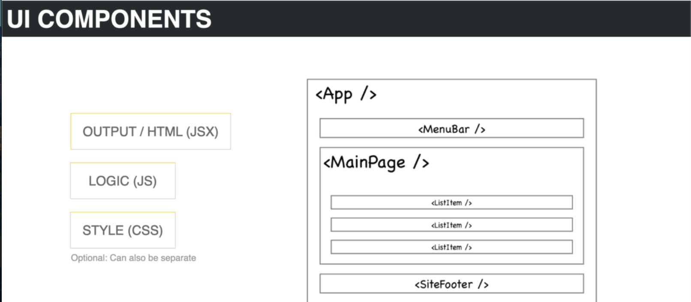
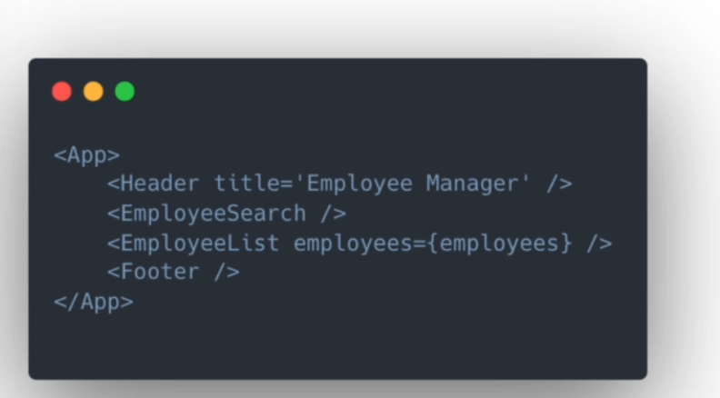

## Topic
This project has being divided into two section, first being a feedback app. And in this one, I want to take things really slow because I want this to be a very beginner friendly. So I'll be explaining things like `components and props`, `state` all the fundaments that you really need to understand to build react applications.

> And the second project will be a Github Finder app where we work with the Github rest API to understand to build react applications to be able to search users look at their profile, will style it with tailwind.We're also going to use the context API along with reducers and use context and use reducer hooks.
>
> Now, the third project is the main one, the biggest one, which is a house marketplace that use Firebase.So users will be able to come to the site register either with just an email and password or with Google  account, and they can list apartments or houses either for sale or for rent. They can set a special discounted price to show up on the offers page, and then every listing will  have a map of the location and it'll also have a slider of all the different images, you can upload up to six images per listing, and will be using Firebase Storage for the images, and you'll be able to go to your profile and mage all your listings so you'll be able to edi the delete them.
> 
> We'll be using the latest version of Firebase, which is version 9 and we'll be using the latest version of React router version 6. 

## Keywords && Points

### What is React?
> React is a Javascript library created and maintained by Facebook that's used for building user interfaces so it's technically a UI library. Now you've probably heard React refereed to as a framework more than a library.

The reason why most people refereed React as a Framework is because it's in direct competition with frameworks like Angular. And it does a slot of some things, and it's used in a lot of the same way.

The only difference between React and angular is that react at its core is only responsible for creating `user interfaces`. It doesn't have things like a router or an HDP client built in. However, we have popular packages like React Router Dom.The we have the fetch API that's already built into the browser. So once you account for some of those things, then it's basically a framework.

Reacts gives us a way to build websites & UIs with organized and reusable components.So components can include the output, which is the basically the HTML in react to use something called JSX. And we'll get into that later.The logic or the Javascript and you can also include the styling or the CSS within the components as well, which is a little different.

### Why Learn React?
> Why not just build all your front ends with just HTML, CSS and vanilla Javascript? Well, as I said before, things used to be really messy with no consistency you'd have everything would be separate.
> 
> React and frameworks in general have made it much easier to organize our user interfaces or our front ends.One of the main reason it gives us organization is worth of reusable components.
>
> React is also very flexible, you can use it for just part of a project if you want.It can be used with mobile apps, with React Native, you could use it along with something like Electron and create a desktop application, you can now have server side rendering with next Js.
>
> React is also very popular.I'd say it's the most popular front end framework in the world at this point.There's a ton of big companies using it.You have a ton of support, so there's a great community, a huge community around React.It's not going anywhere anytime soon.And if you run into problems it's pretty easy to find help.
>
> React also performs very well.It uses something called the virtual dom or virtual document object model.We have separate components in the UI that have something called state, and when a component state changes, react basically compares the existing DOM state with what the new DOM should look like and then it finds the least expensive and most efficient way to update the DOM.So it's very fast and performant.

### Declarative Code
> React is very declarative
> 
> And what I mean by that is we write the code that we want and react is in charge of taking our declared code and performing all the Javascript and DOM steps to get us the result that we want.
>
> So if we we look at this code here, you don't really have to understand react to be able to visualize what this would look like in a browser.

> So each one of these tags that we're looking at is a component.We have the app itself then we have a `header` and `employee search` and `employee list` and a `footer component`. And this is how we embed components. It's similar to just an XML syntax, and components can slo have `props` passed in which are basically attributes or arguments that can be passed to that components. So here we have a `title pop prop` passed into a header component, and it could be just a regular string or any data type, as well as a function.
>
> The `employee lists components` takes in a `prop of employees`. In this case, employees is a variable, which would most likely include an array of employee objects, then an employee list. You could iterate through those objects and output each one in its own component, so `components and props are really important`.
>
> We also have something called `state` that we're going to learn about, and state is basically just `data`, you can have components level state.For instance, maybe you have a menu component that can be toggled, so you might have an opened and closed state that only have to do with that single component.Then you have app level state, which is data that's going to be used in multiple components. So, for example, the employees that you might fetch from a database that's probably going to be your app level state tht you can use in multiple components.
>
>So `Events` are another big part of React because we often have buttons and input fields and input field that fire off some app level state that you can use in multiple components.So events are another big part of React because we often have buttons and inputs fields that fire off some kind of event to make something happen.
>
> So I would say that these four things (`Components,props,state,events`) are the building blocks of not only react, but of many front end frameworks.

The first project, the feedback app, we're going to talk about these four things in depth and look at all the syntax to create and use them.

## Summary