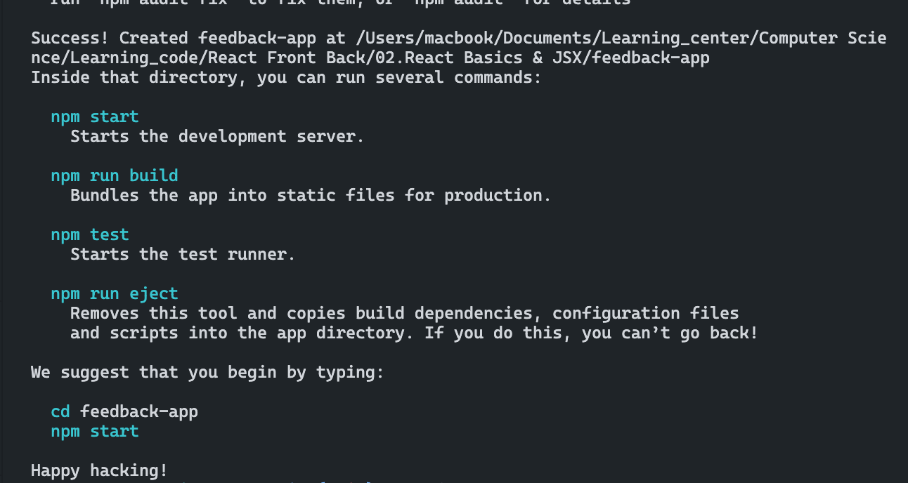

## Topic
> Building Feedback Application
>
>> On this section we will be building Feedback application, this is going to allow us to touch on everything from component, props, state, and events.
>
>> We are going to be using the context API and basically we'll build the client side app first and then we're going to use a tool called Jason Server, which will give us a mock rest API or kind of like a  fake backend to work, with so that we can make request as if it were a full stack app.

## Keyword & Notes

### Create React App
> [React Documentation](https://reactjs.org/)
>> So this is reactjs.org. This is where we can find all the documentation. Through this website you can see all the main concepts, you have some advanced guides, APIs references, hooks and so on. So you can use the documentation as kind of a supplement for the course. So under installation we go to create new React app and we scroll down. You'll see that there's a tool or a command line interface tool called Create React app, which does just that.
>
>>> So we can either install this globally with `npm install - g` or we can just run it with `npx create-react-app my-app`, 

```
npx create-react-app feedback-app --us-npm
```



> Now let's go over some of the files and folders here.
> `package.json` we have all of our dependencies and this include, of course, `React`, which is our main framework or library, and then `React Dom`, which is used to basically allow react to work with the document object model (DOM).So whenever you create a web app, you're going to be using react alongside of the React Dom library, then `react-scripts`, which just gives us some additional tools like the Dev Server. `Web-vitals` will allow us to see some performance analytics.We're not going to really deal with this, but it is included with Create React app.And then you just see the scripts that I've already explained here.
>
>> Righ now, there two main folers to begin with here.There's a `public folder` and a `source folder`
>
>>> So in the `public` you have your `indexed HTML` and when we talk about single page applications or spies, which is what we're creating here, this is the single page that is being loaded in the browser. Ok, so the browser load this HTML page, which has some basic meta tags (as observed in the head), but in the body, all it has is a div with the id of root.
>
```
 <div id="root"></div>
```
>>> Now the reason for that is when we build a single page application.Everything we do, including all of our components, any routes that we have.Everything is done within Javascript.Its  done within React and then its basically inserted into this div.So this div you can think of it like a placeholder for our entire front end, our entire user interface. And I'm gong to show you how that how React knows to, to put it here in a minute.
>
>>> And you can also put in CDNs here on `<head>`. For example, if you wanted to use font awesome or something like tha, you could put in these in the head tags. We'll look more into that later.So whenever we make any changes and save, the server will automatically reload.And then as far as what else we have in the public folder, you can see there's the favicon, any static assets you want to put in here, like images, you can do that, but the source folder is basically where all the magic happens. That's where we create all of our components.All of our context, anything that we do is really going to go in the source folder.
>
>>>Now, usually, I would just kind of go through and explain some of these files.But what I'm going to do and what I'd like you to do is just delete everything in the source folder.Ok, so you should have nothing in the source folder and we're going to see an error over because it's looking for a file called `index.js` in the source folder, which we no longer have. And what I want to do, the reason I deleted all this is so that we can in the next video, recreate the files so you can see exactly what's going on and how react is actually initialized.

### Initializing React
> All right, so in the last session, we did something little crazy, we deleted everything in the source folder. Now the truth is a lot of that stuff we didn't need there was like a logo and some csv file. So we're just going to recreate the things that we need.
>
>> So first of all lets create a file called index.js. That's what it's being looked for.Now, you might see this page again now this is just cached in your browser. We deleted the component that was actually displaying this.So if you're seeing this on windows, you can do shift five, that will do hard refresh. If you're on Mac, you can do command shift R, and that will do a hard refresh, and you should now just a blank white page. Now this page that we're seeing is that public index HTML file, right? You can see the title up here feedback UI. And if we were to to into this HTML file and just type something in there and save, you'll see that's going to show up.
>
> Now what we want to do is, like I said in the last video, this div right here `  <div id="root"></div>`, we want to insert our front end application or Reat app into that div. So that happens in the `index.js` in the source folder, this is basically the entry point to react.
>
> And like I said earlier, the React Dom Library allows us to basically interact with the Document Object Model(DOM) in the browser.So React DOM has a method on it that we want to called render.
>
```
ReactDOM.render()
```
>
> So React is made up of components and you have a root component called app.And then any other components we create, like maybe like a navigation feedback items, whatever it might be, that's going to be embedded into main app component.
>
> So let's go ahead and create inside of source a file called App.js.
>
> Now, as far as components, they can be either classes or functions.Classes are kind of the old school way of creating react components.With more modern react, you're going to see functional components using something called hooks to use state and in some other do some other things with state and lifecycle.
>
>Now there is something called `strict mode` that React offers that add additional checks and warnings within our application. So what we would do is `<App />` where we have our app component, we're  going to wrap this, we're no going to see any difference, but this just activates some additional checks and warnings. And this is what was here befere I actualy deleted the index.js.
>
```
ReactDOM.render( 
    <React.StrictMode >
    <App / >
    </React.StrictMode>,
    document.getElementById('root'))
```
>
> Now the last thing I want to do here , is to add the last file which is called global.css file. So in the source file we are going to create another file called index.css
> 
> There's a lot of different ways to do styling in react. I would say the easiest way is to just have a global style sheet with all your classes and so on. And that's what we're going to do in this particular project.And the way that we can bring this in is in our index.js.


## Summary